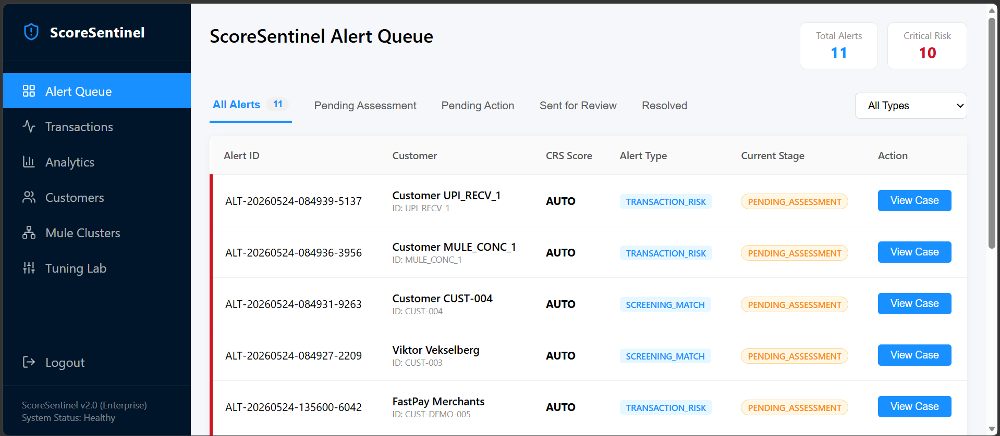
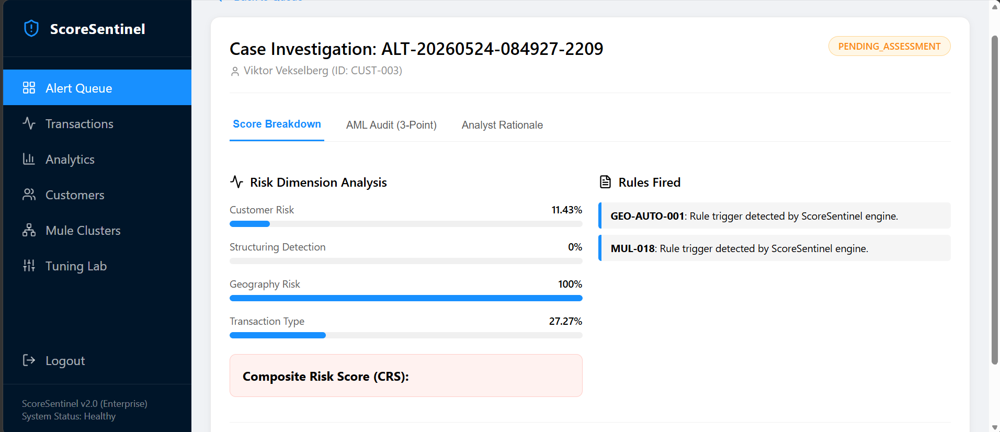
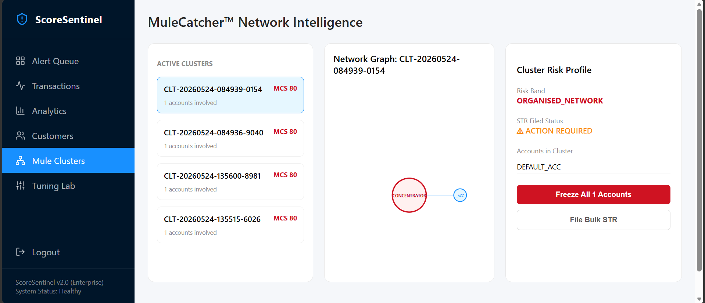

# ScoreSentinel 🛡️

## Automated AML Transaction Risk Scoring Engine + MuleCatcher™

**Author:** Atul Krishnan, CAMS
**Build:** 60-Day Independent Project | 1 Hour Per Day
**Status:** **ENTERPRISE EDITION ✅ (v2.0)**
**Last Updated:** September 2026

---

### 🚀 Live Demo & Infrastructure
*   🛡️ **Live Dashboard:** [transactionmonitoring.vercel.app](https://transactionmonitoring.vercel.app)
*   ⚙️ **API Health:** [scoresentinel-api.onrender.com/api/health](https://scoresentinel-api.onrender.com/api/health)
*   📦 **Architecture:** Supabase (PostgreSQL) + Render (Python/Docker) + Vercel (React)

---

## 💎 What Is ScoreSentinel?

ScoreSentinel is a **CAMS-certified, risk-based AML engine** designed to solve the "black-box" problem in transaction monitoring. It produces a defensible **Composite Risk Score (CRS)** and specialized **Mule Cluster Intelligence (MCS)**, ensuring every alert is 100% explainable to regulators.

> *"ScoreSentinel is not just code; it is a regulatory framework in software form."*

### 🕸️ Project MuleCatcher™ (Overlay)
A proprietary intelligence layer targeting organized fraud rings. It identifies:
*   **Fan-In/Fan-Out:** Coordinated bursts to a single concentrator.
*   **Device Nexus:** Cross-account identification via shared hardware signatures.
*   **Dormant Activation:** Instant alerting on high-velocity shifts in stale accounts.

---

## 🧠 Proprietary Compliance Logic

### 1. The Dual-Resolution Standard (Audit Lock)
Unlike standard case managers, ScoreSentinel enforces a **Hard Block** on case resolution tailored to the risk type:
*   **For Screening Matches (Sanctions/PEP):** Enforces the **Three-Point Identifier Standard**. An analyst must provide 3 unique identifiers and sources (e.g., Passport, Utility Bill) to prove the customer is NOT a match.
*   **For Transaction Risk (Behavioral):** Enforces the **Mandatory Rationale Standard**. An analyst must provide a detailed investigative rationale before clearing behavioral alerts.
*   **Why:** This ensures zero "rubber-stamping" and provides a bulletproof, risk-appropriate audit trail for regulators.

### 2. Composite Risk Scoring (CRS) Calibration
The engine uses a four-dimension weighted matrix:
*   👤 **Customer Risk (30%):** PEPs, UBO complexity, Entity type.
*   📈 **Structuring (25%):** Smurfing, micro-structuring, CTR thresholds.
*   🌍 **Geography (25%):** OFAC, FATF Grey lists, CPI Corridors.
*   💸 **TX Type (20%):** Crypto, Correspondent Banking, Cash Intensives.

**The "Scenario 9" Proof:** In validation, a high-risk shell company wire through a grey-list corridor returns a score of **59.04**. By keeping this below the alert threshold (60), the engine proves it is calibrated to avoid unnecessary noise while maintaining high sensitivity.

### 3. Enterprise Configurable Scenario Engine (v2.0)
Decouples compliance detection rules from hardcoded Python numbers into a parameterized, dynamic scenario catalog conforming to **Fed SR 11-7 / OCC 2011-12**:
*   **`SCEN-STRUC-01` (Structuring / Smurfing):** Rolling-window sub-CTR analysis with configurable bounds ($9,000–$9,999.99), lookback days, and aggregate threshold checks (*FinCEN Advisory FIN-2012-A008 / BSA 31 U.S.C. § 5324*).
*   **`SCEN-VEL-01` (Rapid Fund Movement / Pass-Through):** Evaluates credit inflow vs. rapid debit dissipation velocity within narrow time windows (*FATF Mule Networks / FinCEN FIN-2020-A003*).
*   **`SCEN-CORR-01` (High-Risk Corridor Spike):** Dynamic geographic scoring combined with volume multiplier spikes against customer 30-day baselines (*FATF Rec 19 / OFAC Risk Matrix*).
*   **Dynamic 2LoD Sensitivity Tuning:** Exposes REST API v2 endpoints (`GET /api/v2/scenarios`, `POST /api/v2/scenarios/evaluate`, `PUT /api/v2/scenarios/<id>/parameters`) enabling compliance officers to simulate threshold shifts without code redeployments.

---

## 🖼️ Dashboard Preview


| Alert Queue | Case Investigation | Mule Network Graph |
| :--- | :--- | :--- |
|  |  |  |

> 📊 **View Visual Documentation:** [System Architecture & Data Flow Diagrams](docs/ARCHITECTURE.md)

---

## 🛠️ Repository Structure

```
transactionmonitoring/
│
├── api/                            # Flask REST API (v1.0 & v2.0 Enterprise Endpoints)
├── dashboard/                      # React Case Management (Vercel Hosted)
├── engine/                         # Python Scoring Modules & CAMS Scenario Engine
│   ├── scenarios/                  # Modular Scenario Detectors (STRUC, VEL, CORR)
│   └── scenario_engine.py          # Dynamic Coordinator & Batch Evaluation Runner
├── rules/                          # AML Typology Docs & scenario_catalog.json
├── database/                       # PostgreSQL (Supabase Hosted)
├── tests/                          # Automated Suite (20 Master Scenarios + v2 Test Suite)
└── governance/                     # Model Risk Management (SR 11-7)
```

---

## ⚖️ Regulatory Alignment

| Framework | Implementation |
|---|---|
| **SR 11-7 Model Risk** | Documented weight derivation, FP targets, and recalibration schedule. |
| **FATF Rec 12 — PEPs** | Three-tier PEP structure with domestic/foreign de-escalation. |
| **UK MLR 2017** | Domestic PEP inclusion and 25% UBO threshold enforcement. |
| **OFAC Sanctions** | 50% Ownership Rule engine and SDN fuzzy matching. |
| **BSA/AML** | CTR threshold monitoring and SAR-ready investigation reports. |

---

## ✍️ About the Author

**Atul Krishnan, CAMS**
Senior Financial Crimes Professional | Bank of America HRDT
APAC Regional Screening | PEP | Sanctions | FinCrime SME

*ScoreSentinel is a professional demonstration of AML technology design, built by a compliance expert to bridge the gap between regulatory theory and technical execution.*

**GitHub:** github.com/atulkrishnan18-wq/transactionmonitoring
**Professional Portfolio:** chainsutra.in

---
*ScoreSentinel | Version 1.4 | Authored by Atul Krishnan, CAMS | 25 May 2026*
