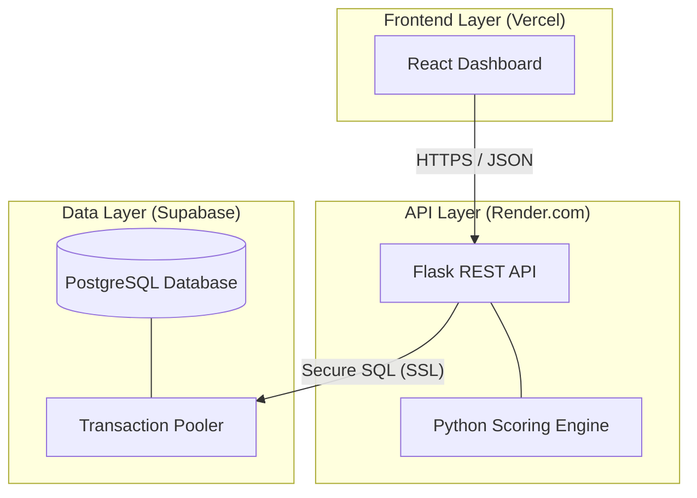
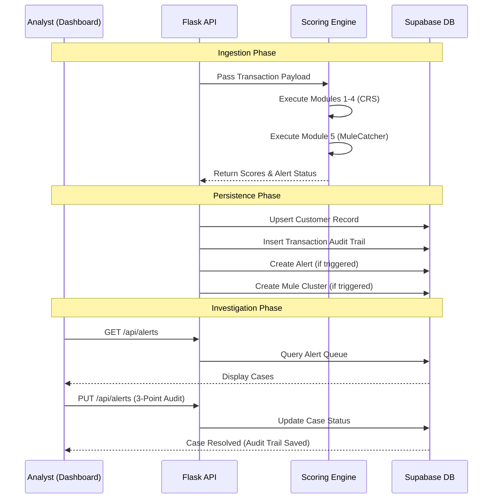

# ARCHITECTURE.md — ScoreSentinel Visual Documentation

**Version:** 1.0 | **Status:** Professional Technical Reference | **Author:** Atul Krishnan, CAMS
**Last Updated:** 24 May 2026

---

## 1. System Architecture Diagram

This diagram shows the multi-cloud infrastructure and the relationship between the Frontend, Backend, and Database layers.

---

## 2. Data Flow Diagram (The Scoring Lifecycle)

This diagram illustrates the step-by-step path of a transaction from ingestion to final alert resolution.

---

## 3. Component Roles & Responsibilities

| Component | Responsibility | Tech Stack |
|---|---|---|
| **React Dashboard** | Provides the visual interface for alert triage, case management, and network graph visualization. Enforces the Three-Point Standard UI. | React, Lucide Icons, Recharts |
| **Flask API** | Acts as the traffic controller. Handles authentication (API Keys), input validation, and database connection pooling. | Python, Flask, Gunicorn |
| **Scoring Engine** | The "Brain." Contains the CAMS-certified logic for Customer, Structuring, Geo, TX Type, and Mule detection. | Python (Rules-based) |
| **Supabase DB** | The "Memory." Provides persistent storage for all audit trails, customer profiles, and alert histories in a secure PostgreSQL instance. | PostgreSQL, PgBouncer |

---

## 4. Operational Design Decisions

### Why Mermaid.js?
Mermaid diagrams are used to ensure the documentation is "Living." Since they are text-based, they are version-controlled alongside the code and render directly in GitHub without needing external image files.

### Why Multi-Cloud?
The separation of Vercel (Frontend), Render (API), and Supabase (DB) demonstrates an enterprise-grade understanding of **decoupled architecture**. This ensures that if one layer goes down, the data remains safe and the system can be scaled independently.

---
*ScoreSentinel | ARCHITECTURE.md | Version 1.0 | Authored by Atul Krishnan, CAMS | 24 May 2026*
