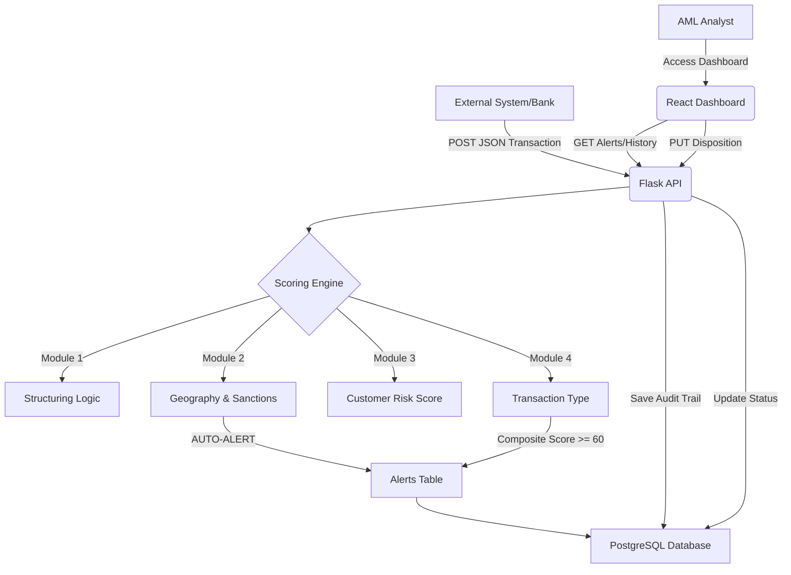

# TECH_STACK_EXPLAINED.md — ScoreSentinel Architecture & Data Flow

**ScoreSentinel AML Transaction Risk Scoring Engine**
**Version:** 1.0 | **Day:** 19 of 60 | **Author:** Atul Krishnan, CAMS
**Last Updated:** 11 May 2026

---

## 1. System Architecture Overview

ScoreSentinel is built using a modern "Full Stack" architecture, combining specialized components for logic execution, data persistence, and user interaction. The system is designed for **explainability, speed, and zero-cost deployment**.

| Component | Technology | Primary Role |
|---|---|---|
| **Scoring Engine** | Python 3.x | Logic execution — implements AML rules, thresholds, and scoring |
| **API Layer** | Flask (Python) | Data ingress/egress — handles requests from external systems |
| **Database** | PostgreSQL | Persistence — stores transactions, customer profiles, and alert logs |
| **Dashboard** | React (TypeScript) | UI/UX — analyst case management interface and analytics |
| **Infrastructure** | Render + Vercel | Cloud hosting — manages deployment and public availability |

---

## 2. Component Deep Dive

### 2.1 The Scoring Engine (Python)
The "Brain" of ScoreSentinel. Python was chosen for its dominance in data science and its ability to represent complex conditional logic (if-then-else) in a way that is readable by both developers and compliance officers.
- **Sequential Execution:** Logic follows the four-module structure (Structuring → Geography → Customer → Transaction Type).
- **Independent Modules:** Each module is a discrete Python script, allowing for easier updates and independent testing.
- **Fail-Fast Sanctions:** Geography module triggers a sanctions hit, the engine terminates processing and returns an immediate AUTO-ALERT.

### 2.2 The API Layer (Flask)
The "Door" to the system. Flask is a lightweight REST API framework.
- **POST /api/score:** Accepts JSON transaction data, passes it to the engine, and returns the result.
- **PUT /api/alerts:** Allows analysts to update alert status (e.g., from "Pending" to "Resolved") following the three-point documentation standard.
- **Security:** Implements basic authentication and input validation to prevent SQL injection or malformed data entry.

### 2.3 The Database (PostgreSQL)
The "Memory" of the system. An enterprise-grade relational database.
- **Transactions Table:** Stores every field from every transaction attempt (the Audit Trail).
- **Customers Table:** Stores CCRS (Customer Risk Score) components and beneficial ownership data.
- **Alerts Table:** Stores metadata for cases requiring analyst intervention (timestamps, reviewer IDs, dispositions).

### 2.4 The Dashboard (React)
The "Face" of the system. A modern web interface.
- **Real-time Queue:** Displays alerts as they are generated by the engine.
- **Explainability UI:** Shows a visual breakdown of the composite score (e.g., "30% from Geography, 25% from Structuring").
- **Case Management:** Enforces the "Three-Point Decision Standard" — analysts cannot close a case without documenting the Rationale, Review, and Result.

---

## 3. Data Flow Diagram

---

## 4. Zero-Cost Deployment Plan

ScoreSentinel is designed to run entirely on "Free Tier" cloud infrastructure without sacrificing performance for a portfolio-scale project.

| Layer | Provider | URL | Plan | Cost |
|---|---|---|---|---|
| API & Engine | **Render.com** | [scoresentinel-api.onrender.com](https://scoresentinel-api.onrender.com) | Web Service | £0 |
| Database | **Supabase** | [Tokyo/Singapore Region] | PostgreSQL | £0 |
| Dashboard | **Vercel.com** | [transactionmonitoring.vercel.app](https://transactionmonitoring.vercel.app) | Hobby Plan | £0 |
| SSL / Security | **Cloudflare** | Free Plan | £0 |

---

## 5. Model Governance Alignment

The choice of this tech stack directly supports **SR 11-7** compliance:
- **Traceability:** Python logic is explicit; there are no hidden neural network weights.
- **Integrity:** PostgreSQL ensures data cannot be modified without being captured in an audit log.
- **Explainability:** The React dashboard presents the engine's logic in a human-readable format.

---

*ScoreSentinel | TECH_STACK_EXPLAINED.md | Version 1.0 | Day 19 of 60 | 11 May 2026*
